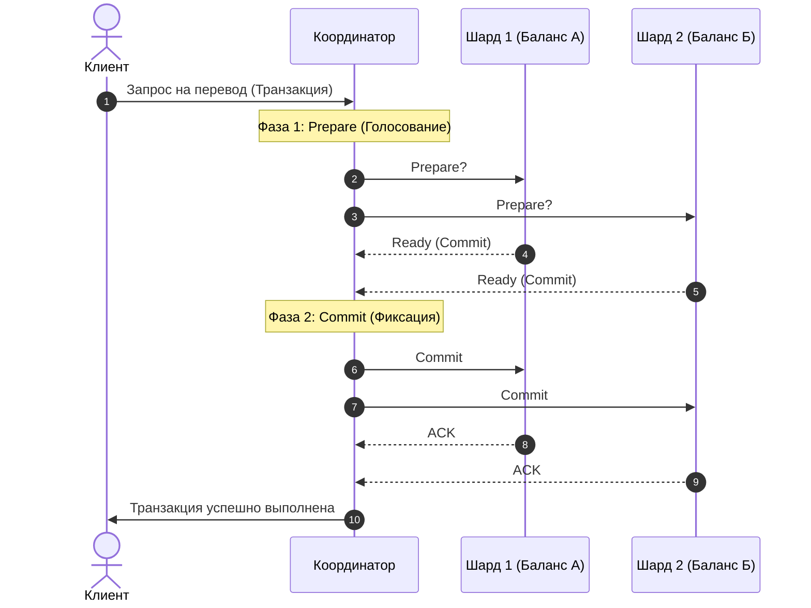

# Введение

Современные высоконагруженные информационные системы предъявляют жесткие требования к масштабируемости, надежности и производительности систем хранения данных. При переходе от монолитных архитектур к распределенным системам возникает необходимость решения фундаментальных инженерных и теоретических задач. Настоящая заметка систематизирует ключевые методы построения распределенных баз данных, группируя их вокруг трех базовых концепций:
1. **Шардирование (Sharding)** — горизонтальное фрагментирование данных для распределения нагрузки чтения и записи.
2. **Репликация (Replication)** — избыточное копирование данных с целью обеспечения отказоустойчивости и высокой доступности.
3. **Распределенный консенсус (Distributed Consensus)** — протоколы согласования состояния и выбора лидера в ненадежных средах.

# Шардирование (Sharding)

Целью шардирования является горизонтальное масштабирование (Scale-Out) базы данных для обеспечения хранения петабайтных объемов информации и обработки сотен тысяч запросов в секунду (RPS). Для прикладного уровня распределенная база данных должна представляться единым логическим пространством, скрывая физическую фрагментацию данных между множеством узлов.

В отличие от вертикального масштабирования (Scale-Up), которое ограничено физическим потолком аппаратных мощностей одного сервера (емкостью RAM, NVMe-накопителей и количеством ядер CPU) и характеризуется нелинейным ростом стоимости оборудования, горизонтальное масштабирование распределяет нагрузку на кластер из стандартных серверов (Commodity Hardware).

Реализация горизонтального масштабирования требует решения двух основных задач:
* **Фрагментация:** алгоритмическое разделение единого набора данных на независимые сегменты (шарды).
* **Маршрутизация:** прозрачное определение целевого узла, содержащего запрашиваемые данные, без избыточных опросов всех серверов кластера.

## Hash Sharding (Хеширование по модулю)

Метод основан на применении хеш-функции к первичному ключу записи с последующим вычислением остатка от деления на количество доступных узлов $N$:

$$
\text{Node} = \text{hash}(\text{key}) \pmod{N}
$$

Этот алгоритм находит применение при ручном партиционировании в традиционных реляционных СУБД (например, PostgreSQL, MySQL) и распределенных хранилищах (например, Redis Cluster).

* **Преимущества:** Обеспечивает равномерное распределение данных по узлам кластера и минимизирует вероятность возникновения перегруженных («горячих») шардов при последовательной генерации ключей.
* **Недостатки:** Высокая чувствительность к изменению топологии кластера. При добавлении или удалении узла (изменении значения $N$) формула пересчитывается для большинства существующих ключей. Это требует перераспределения и миграции до $\frac{N-1}{N}$ объема всех данных (например, до $75\%$ при переходе с 3 на 4 узла), что создает критическую нагрузку на дисковую и сетевую подсистемы в работающей базе данных.

### Consistent Hashing (Последовательное хеширование)

Последовательное хеширование решает проблему высокой стоимости ребалансировки данных при изменении конфигурации кластера.

В данном подходе хеш-пространство представляется в виде замкнутого виртуального кольца (например, с диапазоном значений от $0$ до $2^{32} - 1$). На это кольцо проецируются как хеш-адреса физических узлов, так и хеш-значения ключей данных. Для определения целевого узла выполняется движение по часовой стрелке от точки хеша ключа до первого встреченного узла.

* **Преимущества:** При изменении количества узлов миграции подвергается лишь незначительная часть данных (в среднем $1/N$ от общего объема), расположенная на смежных участках кольца. Остальные серверы ребалансировка не затрагивает. Для сглаживания неравномерности распределения часто применяются виртуальные узлы (vnodes).
* **Применение:** Apache Cassandra, Amazon DynamoDB, распределенные системы кэширования (Memcached).
* **Недостатки:** Метод неэффективен для диапазонных запросов (Range Queries, например, `SELECT * WHERE id BETWEEN 10 AND 100`). Поскольку логически последовательные ключи распределяются по кольцу хаотично, для выполнения такого запроса требуется опрашивать все узлы кластера.

## Lookup Sharding (Шардирование по справочнику)

При использовании данного метода логика маршрутизации выносится во внешний высокопроизводительный сервис-роутер или специализированную системную таблицу, где хранится явное сопоставление ключей или их диапазонов конкретным физическим серверам:

$$
\text{Key} \to \text{Node}
$$

* **Преимущества:** Высокая гибкость управления. Позволяет вручную или автоматически переносить данные конкретных крупных клиентов («тяжелых» пользователей) на выделенные, более производительные аппаратные узлы.
* **Недостатки:** Справочник маршрутизации становится единой точкой отказа (Single Point of Failure) и критическим узким местом производительности (bottleneck). Сбой или деградация производительности сервиса-роутера приводит к полной парализации всей распределенной базы данных.

## Range Sharding (Диапазонное шардирование)

Диапазонное шардирование предполагает автоматическое разделение таблицы на упорядоченные непрерывные диапазоны по первичному ключу (Primary Key). Каждый полученный сегмент называется шардом (или таблетой — tablet в терминологии YDB).

Например, для таблицы с ключом `user_id` шард №1 обслуживает диапазон $[1, 100\,000]$, шард №2 — $[100\,001, 200\,000]$ и так далее.

* **Механизм маршрутизации:** Вычислительный слой базы данных (например, слой Compute в YDB) кэширует схему распределения диапазонов. При получении запроса вычислительный узел обращается к локальной карте распределения, мгновенно определяет целевой шард и направляет запрос непосредственно к обслуживающему его узлу.
* **Преимущества:** Идеальная поддержка диапазонных запросов, поскольку последовательные записи физически локализованы в одном или соседних шардах, что минимизирует сетевой обмен внутри кластера.
* **Недостатки:** Риск возникновения зон высокой нагрузки (hotspots) при монотонно возрастающих ключах (например, автоинкрементные идентификаторы или временные метки). В этом случае все новые операции записи будут направляться исключительно на последний шард, сводя к нулю преимущества параллельной обработки данных на нескольких серверах.

# Репликация (Replication)

Репликация предназначена для обеспечения высокой доступности (High Availability) и отказоустойчивости (Fault Tolerance) распределенной системы в условиях неизбежных аппаратных сбоев (выход из строя жестких дисков, серверов, нарушение сетевой связности). Дублирование данных на нескольких физических узлах устраняет единую точку отказа (Single Point of Failure).

При проектировании репликации выделяют три фундаментальные инженерные задачи:
1. Выбор оптимальной физической избыточности (метода хранения копий).
2. Определение модели согласования данных при записи.
3. Разработка автоматических механизмов координации и выбора лидирующего узла.

## Методы обеспечения избыточности

### Многократное зеркалирование (Replication Factor)
Классический подход (например, $3$-Way Mirroring) предполагает хранение трех полных идентичных копий данных на различных узлах (и желательно в разных дата-центрах). Это создает накладные расходы по дисковому пространству в размере $200\%$ (для хранения 1 ПБ полезных данных требуется арендовать или приобрести 3 ПБ физических носителей). Минимальная избыточность для выживания при отказе одной ноды составляет 2 копии, при отказе двух нод — 3 копии.

### Избыточное кодирование (Erasure Coding)
Вместо хранения полных физических копий к данным применяются алгоритмы линейной алгебры (коды Рида-Соломона). Исходный блок данных разбивается на $K$ информационных частей, на основе которых вычисляются $M$ контрольных фрагментов (паритетов). Полученные $K+M$ блоков распределяются по независимым серверам.

Примером является схема $4+2$:
* Исходный сегмент данных делится на 4 равные части.
* На их основе рассчитываются 2 контрольных блока Рида-Соломона.
* Все 6 блоков записываются на 6 различных серверов.
* **Результат:** СУБД сохраняет полную работоспособность и восстанавливает данные при одновременном выходе из строя любых двух серверов. При этом накладные расходы дискового пространства составляют всего $50\%$ ($M/K = 2/4$), что позволяет значительно сократить капитальные затраты по сравнению с тройным зеркалированием при аналогичной степени надежности.

## Модели согласования при репликации

### Строгая синхронная репликация
Лидер принимает запрос на запись от клиента, транслирует его на все реплики и ожидает подтверждения от каждого узла перед возвратом успешного ответа приложению.
* **Влияние на производительность:** Существенное увеличение времени отклика (latency), которое ограничивается скоростью работы наиболее медленного (или испытывающего сетевые задержки) узла в кластере. Сбой хотя бы одной реплики блокирует операции записи в систему.
* **Гарантии:** Абсолютная сохранность данных. Риск потери подтвержденных транзакций при отказе лидера исключен.

### Асинхронная репликация
Лидер фиксирует изменения локально и незамедлительно возвращает подтверждение клиенту, отправляя данные на реплики в фоновом асинхронном режиме.
* **Влияние на производительность:** Минимальные задержки при записи, высокая пропускная способность.
* **Гарантии:** Низкие. При аварии лидера транзакции, не успевшие реплицироваться, безвозвратно теряются. Чтение со сторонних реплик может возвращать устаревшие данные (Stale Reads). Данная модель является стандартной для классических связок Master-Slave в СУБД PostgreSQL и MySQL.

### Кворумная репликация (Quorum-based)
Компромиссный подход, при котором для успешного завершения операции требуется согласие большинства узлов. Для кластера из $N$ реплик кворум записи $W$ (минимальное число узлов, подтвердивших запись) определяется как:

$$
W = \left\lfloor \frac{N}{2} \right\rfloor + 1
$$

Для кластера из $N=3$ реплик кворум записи составляет $W=2$. Лидер параллельно отправляет пакет обновлений всем репликам и возвращает ответ клиенту, как только получит подтверждение от любых двух узлов (включая себя). Это позволяет игнорировать задержки или сбои на третьем узле.

Для обеспечения строгой согласованности при чтении вводится кворум чтения $R$, удовлетворяющий классическому условию:

$$
W + R > N
$$

Это гарантирует, что пересечение множеств узлов чтения и записи обязательно содержит как минимум один узел с актуальной версией данных. Накладные расходы на запись ограничиваются задержкой (RTT) до ближайшего географически соседа, что нивелирует проблему «длинного хвоста» сетевых задержек.

# Распределенный консенсус (Distributed Consensus)

Алгоритмы консенсуса обеспечивают согласованное изменение состояния системы группой независимых узлов в ненадежной сети (где возможны потери сообщений, задержки и сбои узлов). Одной из ключевых задач консенсуса является автоматический выбор лидера (Leader Election) и управление реплицируемым логом команд.

## Raft

Алгоритм Raft декомпозирует задачу консенсуса на четко определенные субпроцессы, ориентированные на сильное лидерство и строгую последовательность логов.

### Механизм выбора лидера
Узлы в Raft могут находиться в одном из трех состояний: Leader, Follower или Candidate. Время разделено на логические эпохи (Terms), идентифицируемые монотонно возрастающими числами.

1. **Нормальный режим:** Лидер регулярно отправляет подчиненным узлам (followers) пустые сообщения поддержания активности — heartbeats (`AppendEntries`).
2. **Инициация выборов:** Если фолловер не получает heartbeat в течение случайного таймаута (Election Timeout, обычно в пределах 150-300 мс), он предполагает сбой лидера, переходит в состояние Candidate, инкрементирует номер текущей эпохи (Term), голосует за себя и рассылает запрос `RequestVote` остальным узлам.
3. **Голосование:** Узел отдает голос кандидату только в том случае, если он еще не голосовал в этой эпохе, и лог кандидата является не менее актуальным, чем его собственный (критерий актуальности оценивается по индексу и терму последней записи).
4. **Завершение выборов:** Кандидат, собравший голоса большинства узлов ($W$), объявляет себя новым Лидером и возобновляет отправку heartbeats, подавляя дальнейшие выборы в текущей эпохе.

После выбора Лидер берет на себя управление записью: принимает команды от клиентов, вносит их в свой лог и реплицирует на фолловеров. После получения подтверждения от кворума запись фиксируется (Commit) и применяется к машине состояний (State Machine).

* **Применение:** Etcd (координация Kubernetes), CockroachDB, ClickHouse (ClickHouse Keeper).

## Paxos

Протокол Paxos — фундаментальный стандарт распределенного консенсуса. В отличие от Raft, классический Paxos (Single-Decree Paxos) решает задачу достижения согласия по единственному значению в группе узлов без обязательного наличия постоянного лидера для каждой операции. Роли распределены между Proposers (предлагающие узлы), Acceptors (принимающие узлы) и Learners (получатели консенсусного значения).

Согласование выполняется в две фазы:
1. **Prepare Phase (Подготовка):** Proposer отправляет Acceptor-ам запрос с уникальным номером предложения $n$. Если $n$ превышает номера всех ранее полученных предложений, Acceptor обязуется отклонять любые последующие предложения с меньшими номерами и возвращает Proposer-у уже принятое им ранее предложение с максимальным номером.
2. **Accept Phase (Принятие):** При получении согласия от большинства Acceptor-ов Proposer отправляет запрос на фиксацию значения $v$ (которое берется из ответов первой фазы или выбирается Proposer-ом самостоятельно, если ответов не было). Acceptor-ы одобряют предложение, если это не противоречит их ранее принятым обязательствам.

В промышленной эксплуатации для снижения сетевых накладных расходов классического Paxos используется модификация **Multi-Paxos**, которая вводит концепцию выделенного лидера, позволяя амортизировать фазу подготовки на поток транзакций.

* **Применение:** YDB, Google Spanner, Apache Cassandra (Lightweight Transactions).

## ZooKeeper Atomic Broadcast (ZAB)

Протокол ZAB разработан специально для координационного сервиса Apache ZooKeeper. Концептуально он близок к Raft (использует выделенного лидера и разделение на эпохи), однако оптимизирован под иерархическую структуру данных в оперативной памяти (z-nodes) и гарантирует строгое сохранение порядка обновлений (FIFO-последовательность для транзакций одного клиента).

Протокол ZAB функционирует в двух режимах:
* **Recovery (Восстановление):** Узлы определяют нового лидера с наиболее полной и актуальной историей транзакций, после чего синхронизируют состояние отстающих фолловеров с лидером.
* **Broadcast (Вещание):** Лидер транслирует изменения в виде транзакций, снабженных монотонно возрастающим идентификатором (ZXID). Изменения применяются к хранилищу после согласования по двухфазной схеме с кворумом узлов (без возможности отката транзакции на фазе коммита).

* **Применение:** Apache ZooKeeper (координация распределенной инфраструктуры в Apache Hadoop, ранних версиях Apache Kafka, Apache HBase).

# Распределенные транзакции: Двухфазный коммит (2PC)

В шардированных архитектурах операции часто затрагивают данные, расположенные на физически независимых узлах (межшардовые транзакции). Классический сценарий — перевод денежных средств со счета пользователя $A$ (Шард 1) на счет пользователя $B$ (Шард 2). Если списание с баланса $A$ завершится успешно, а начисление на баланс $B$ прервется сбоем, транзакция нарушит фундаментальное требование атомарности (Atomicity).

Для решения этой задачи применяется протокол **двухфазной фиксации (Two-Phase Commit, 2PC)** под управлением выделенного узла-координатора (Transaction Coordinator), взаимодействующего с участниками (Resource Managers / Cohorts).

### Механизм функционирования 2PC

1. **Фаза подготовки (Prepare Phase / Voting):**
   * Координатор отправляет запрос на подготовку (`Prepare`) всем участвующим в транзакции шардам.
   * Каждый шард локально выполняет валидацию операции, блокирует соответствующие ресурсы (строки таблиц) и записывает изменения в предварительный лог (WAL).
   * При успешном завершении подготовки узел отправляет координатору ответ «Готов» (`Vote_Commit`). В случае сбоя или невозможности выполнить операцию возвращается ответ «Не готов» (`Vote_Abort`).

2. **Фаза фиксации (Commit Phase / Execution):**
   * **Успешный коммит:** Если все узлы-участники проголосовали «Готов», координатор принимает решение о фиксации, записывает его в свой лог и отправляет команду `Commit` всем шардам. Узлы применяют изменения, снимают блокировки ресурсов и отправляют подтверждение (`ACK`).
   * **Откат транзакции:** Если хотя бы один узел ответил «Не готов» (или не прислал ответ в рамках таймаута), координатор принимает решение об отмене. Он направляет команду `Rollback / Abort` всем участникам, после чего они сбрасывают подготовленные изменения и снимают блокировки.

### Недостатки протокола 2PC

* **Блокирующий характер (Blocking Protocol):** Координатор является центральным звеном. Если он выходит из строя во время второй фазы (после того, как участники проголосовали «Готов», но до рассылки финального решения `Commit`/`Abort`), все участвующие шарды вынуждены бесконечно долго удерживать блокировки ресурсов в ожидании восстановления координатора, поскольку они не знают итогового статуса транзакции. Это может привести к каскадной деградации производительности всей СУБД.
* **Низкая производительность:** Двухфазный цикл обмена сообщениями существенно увеличивает время удержания транзакционных блокировок и сетевые задержки (latency), снижая общую пропускную способность распределенной базы данных.

---

# Анализ неполноты исходной логики и направления для уточнения

При проработке архитектурного описания распределенной инфраструктуры рекомендуется дополнительно конкретизировать следующие аспекты:

1. **Способы борьбы с «горячими» точками в Range Sharding:** Диапазонное шардирование уязвимо к монотонно возрастающим ключам. Необходимо явно указать архитектурные паттерны компенсации этой проблемы, такие как добавление случайного префикса (солирование ключа, salting) или предварительное ручное секционирование (pre-splitting).
2. **Дилемма CAP и PACELC:** Для полноты теоретического обоснования систем репликации и консенсуса целесообразно интегрировать теоремы CAP и PACELC, объясняющие неизбежные компромиссы между согласованностью (Consistency), доступностью (Availability) и задержкой (Latency) в распределенных средах.
3. **Различие между двухфазным коммитом (2PC) и двухфазным блокированием (2PL):** В контексте распределенных транзакций важно не допускать смешения понятий: 2PC обеспечивает *атомарность* распределенной транзакции, в то время как 2PL (Two-Phase Locking) решает задачу *изоляции* конкурентных транзакций.
